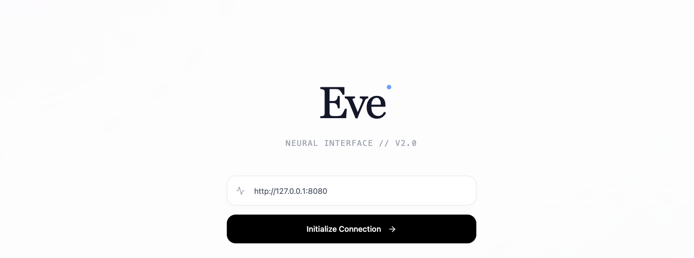
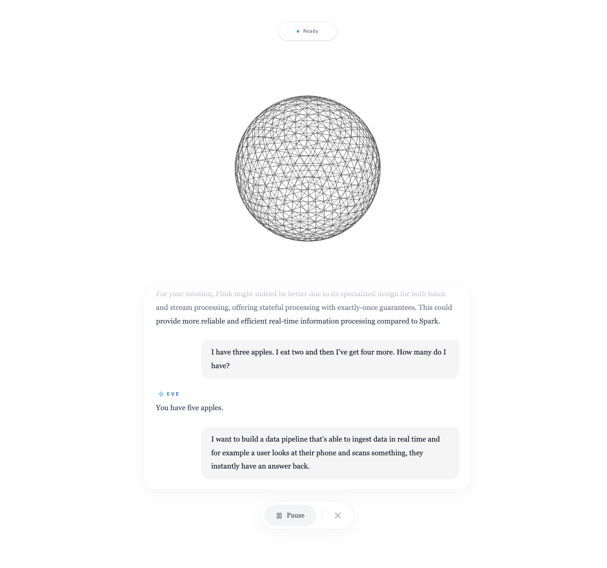

# Project Name

**Tags:** `react` `typescript` `vite` `tailwindcss` `cli` `jarvis-ui`

## Project Explanation

This project serves as the user interface (UI) for Jarvis, a personal AI assistant. It's built with React and TypeScript, leveraging Vite for a fast development experience and TailwindCSS for styling. The goal of this UI is to provide an intuitive and interactive way to communicate with and control the Jarvis backend.

## Features (Planned/Implemented)

- **Voice Command Interface:** Interact with Jarvis using spoken commands.
- **Real-time Feedback:** Visual and auditory feedback for Jarvis's responses and actions.
- **Customizable Widgets:** Display key information and controls relevant to Jarvis's functionalities.
- **Theming:** Personalize the UI with different visual themes.

## Getting Started

More details on how to set up and run the project will be provided here.

## Screenshot

